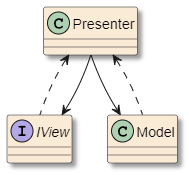
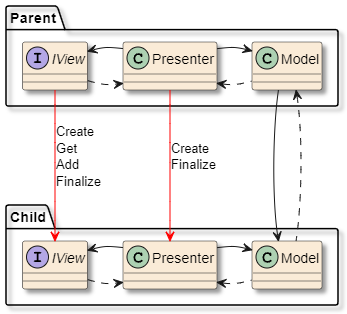
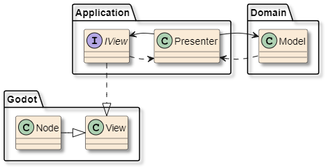

<!--https://docs.github.com/en/get-started/writing-on-github/getting-started-with-writing-and-formatting-on-github/basic-writing-and-formatting-syntax -->

# Minesweeper Model-View-Presenter in Godot 4.4 - C\#

This project showcases the use of Model-View-Presenter (MVP) pattern in Godot. View this more like a fun experiment than a concrete way of doing things.

<!--
A tutorial series which helped me to understand MVVM on an example (this project was originally supposed to use purely an MVVM pattern):
<https://www.youtube.com/watch?v=fZxZswmC_BY&list=PLA8ZIAm2I03hS41Fy4vFpRw8AdYNBXmNm>
A blog talking about combining MVC, MVP and MVVM patterns and understanding their differences:
<https://gexiaoguo.github.io/MVC,-MVP-and-MVVM/>
An article about implementing data binding for MVVM:
<https://learn.microsoft.com/en-us/archive/msdn-magazine/2016/july/data-binding-a-better-way-to-implement-data-binding-in-net>
-->

> [!TIP]
> See video series by SingletonSean: [WPF MVVM TUTORIAL](https://www.youtube.com/watch?v=fZxZswmC_BY&list=PLA8ZIAm2I03hS41Fy4vFpRw8AdYNBXmNm).
> Originally this project was supposed to use MVVM pattern instead of MVP, so I used this tutorial as a reference.
>
> See blog [Combining MVC, MVP and MVVM](https://gexiaoguo.github.io/MVC,-MVP-and-MVVM/) to understand mediator patterns and their differences.

## Model-View-Presenter Pattern

A simple MVP triad is composed of three objects:

- Model - logic (business logic)
- View - UI
- Presenter - Model<->View communication



The Presenter calls Model and View down, while View and Model signal (invoke events) up to Presenter.
When user interacts with a View, it signals its Presenter who calls its Model.
If the Model changed, it signals Presenter back, who updates the View.

MVP is not suited for games that would need 30 - 60 updates per second, as each update needs to go through the whole triad.
That's why turn based games work with MVP, because there things usually happen only in respose to (relatively) occasional user inputs. But there are situations, where you need to update something every frame, for example drag and dropping a card in a card game.
Luckily these updates can stay in the View, as the Model only cares for when the card actually drops.

The View is defined as an interface to allow multiple View implementations. In this project Views are implemented as Godot nodes/scenes. And because scenes can naturally contain other scenes, I decided to reflect this by using a Hierarchical MVP.

> [!TIP]
> It can be beneficial to have interfaces for Models and Presenters too, if you plan to have mock classes for testing.

> [!TIP]
> Some clarifications:
>
> - Not all Godot scenes have to be Views.
> - Not all Models need to have their own Triad. For example TileModel does not have a "TilePresenter" or "TileView". TileModel is simply used by a MinefieldModel to store information about the tiles.

## Hierarchical MVP Pattern

The communication between a child and a parent Triad is done through their Models.
The parent Model calls the child Model, while the child signals parent its changes.



For example in this project the Minefield Triad is nested under GameSession.
The Minefield handles user revealing/flagging tiles and GameSession handles navigation buttons and a duration timer.
The GameSession's Model needs to listen for events from Minefield's Model to know when should the timer start/stop (first tile was revealed/game ended).

The relations between parent Presenter/View and child Presenter/View are reserved only for initialization, finalization and retrieval (red arrows in the picture).

> [!WARNING]
> The Triad objects have to be finalized to break any circular dependencies, created when one object holds a reference to another one, while being subscribed to its events.
>
> Godot scenes do this through QueueFree, while my Presenters implement IDisposable, where all events are unsubscribed.
>
> Additionally some Models also need to implement it, like mentioned GameSession's Model.

## Project structure

The project is divided into three layers:

- MinesweeperMVP.Domain - Models
- MinesweeperMVP.Application - Presenters + View interfaces
- MinesweeperMVP.Godot - View implementations



> [!IMPORTANT]
> Godot by default assumes that both .csproj and .sln files are in the same folder and have the same name. To have .sln in a different folder change this setting: Project settings > dotnet > solution_folder (to "../" for example).
>
> But it is not possible for them to have different names.
> In my example they share the name MinesweeperMVP,
> but the project is in a MinesweeperMVP.Godot folder and has MinesweeperMVP.Godot root namespace.

The files in those projects are divided by features. If a file is used by mutliple features, it is placed into a Common folder, otherwise into a feature folder. Features can contain other features, which leads to nested folders.
The features in .Application and .Godot projects are Triads themselves, while in the .Domain the features are more general, because the file quantity is smaller.

For example these are some folders from MinesweeperMVP.Application project:

```
MinesweeperMVP.Application
├── Common
│   ├── Interfaces
│   ├── Enums
│   └── Events
└── Main
    ├── Menu
    │   └── MinefieldSettings
    ├── GameSession
    │   └── Minefield
    └── HighscoreBoard
```

Main, Menu, MinefieldSettings, GameSession, Minefield and HighscoreBoard are all Triads.

> [!TIP]
> See video by GDQuest: [What's the best file structure for Godot projects?](https://www.youtube.com/watch?v=kH5HkKNImXo).

## Entry Point - App and Bootstrapper

App is a class that represents the whole application. But as it is in the Application project, it cannot be the program's entry point, as the project is just a library.

The program's entry point lies in the Godot project, specifically in the Bootstrapper class, which is an autoload. The Bootstrapper creates the App, starts it and frees itself.

The advantage of having a Bootstrapper in the Godot project is that we can take advantage of some Godot specific features and pass them to App as arguments.

> [!TIP]
> Use `ProjectSettings.GlobalizePath("user://");` to get the folder where Godot games save user specific data and pass it into App's constructor. Then App can save files in there. This will keep your program in line with other Godot programs.

## Commands, Services and Stores

In addition to Views and Models, Presenters interact with these classes:

1. **Command** - Encapsulates a response to user input (to an event from View). They implement the ICommand interface.
2. **Service** - Encapsulates a complex action. The Service is initialized by a parent class (App) and given to a child (Presenter) to use it without needing to know the arguments it was initialized with.
3. **Store** - Each Store represents a single point of truth. Thus Stores can be viewed as singletons.

An example of a Store could be an AppSettingsStore (not in my project), which would store graphic settings, keybinds and other things.
In contrast there is the MinefieldSettingsModel, which is not a Store, because it directly impacts a Model (MinefieldModel is initialized based on MinefieldSettingsModel).

> [!TIP]
> Not all Triads need to have a Model. The Presenter can interact with just a Store instead.
> For example the Menu "Triad" does not have a MenuModel.
> The MenuPresenter interacts only with a NavigationStore (see [Navigation](#navigation)).
>
> The Presenter is just a mediator between a View and something else, which can be a Model, Store, combination of both, or even multiple Models or Stores.

## Navigation

MainView is set as Godot's main scene. It does not change. Instead it manages switching its nested View for another one whenever the NavigationStore.CurrentPresenter changes.

To modify the NavigationStore a NavigationService is created, which takes a Presenter factory method as an argument. This means whenever you navigate to a new View, a new Presenter is always created. Then the MainView swaps its old nested View for the new Presenter's View.

Usually the NavigationService is encapsulated in a NavigateCommand.

> [!TIP]
> To change the initial MainView's nested View, change the `App.CreateInitialPresenter` method to return a different Presenter. Useful for testing.
>
> Note that the Presenter needs to be robust enough to be able to be created "out of the usual order".

> [!TIP]
> As seen in the project, MainView can also manage View transition animation (fade in/out).

## Saving and Repositories

## Hello World

Lets have a HelloWorldView scene. It is set as the Main scene. The Label and Button have unique names set (% symbol).

App class is an autoload.

<!--
### Triad categories

The following categories are not reflected in the class structure.

1. Main triad (Main

- only one, acts almost like a the window
  
1. Screen triad (Menu, GameSession)

- encompasses the whole screen
- the Main triad shows one Screen triad at a time
- switches between different Screen triads via the NavigationStore
  
1. Nested triad (MinefieldSettings, Minefield)

- part of Screen triads

Note that the Screen triad is technically also nested under the main triad.
And also a Nested triad can technically also be a Screen triad.

### Implementing a new Screen triad

#### Models

Create domain objects that the presenter will use (if they don't exist).

#### View

Create a new IView interface type.
In Godot create a new scene whose root Node will implement the new IView interface.
Expand ViewFactory, so its generic Crete method can create this new Scene.

#### Presenter

Presenter should take its View and Domain objects (also services, stores) through the constructor (dependency injection).
In the App create a factory method for the presenter.

### Implementing a new Nested triad, whose View is contained in a View of another Triad

This is synonymous to when you instantiate a scene in another scene via the editor.
In this case, the View will not be creted through a ViewFactory, but retrieved by the Parent View

- e.g. IGameSessionView.GetMinefieldView()
  
WARNING: such method should wait until the Node is ready, but in order to do so, it needs to be async, but it has a return value (the nested View)
so the return type needs to be a Task, which changes it signature.
This is not ideal, as this method is part of an View interface, which should not care that in Godot it needs to be async.
Because of this, these Nested View retrieval methods do not wait till node is ready and the possibility of an error exists.
Technically it should not be a problem, because of how the triads are initialized, but it is something to be weary of.

Also you do not need a factory method in the App for such Views.


## App

App is the entry point. From Godot's point of view, it is the "Main Scene".

### Dependency injections

App is the only class, which creates Triad elements and Stores via factory methods.

- factory methods: CreateMenuPresenter(), CreateGameSessionPresenter()
- e.g. instead of GameSessionPresenter creating its own nested MinefieldPresenter, it takes an object of type IMinefieldPresenter (interface) through its constructor, which is being handled by CreateGameSessionPresenter() factory method

### Changing the "Main Scene"

As the App is the official "Main Scene", the method CreateInitialPresenter() takes this role. Change the factory method inside to change what gets displayed first.
Note that these factory methods should be robust enough to handle going straight to the GameSession instead of Menu.

- e.g. GameSessionModel's MinefieldModel takes numbers of rows, columns and mines in its constructor
 the App's respective factory method while creating the MinefieldModel links these values to values from MinefieldSettingsModel,
 which is persistent. The MinefieldSettingsModel is passed to menu, where its values can be modified
 But the MinefieldModel does not rely on you setting these values in the menu first.

## Navigation store/service/commands

App should hold a reference

### Scene switching/transitions
